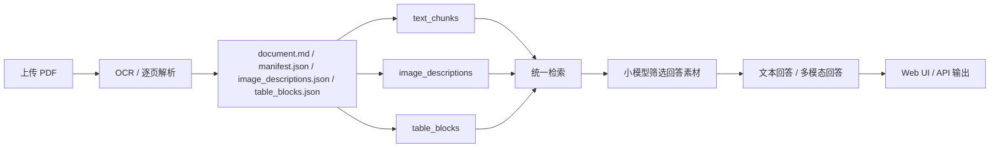

# 复杂文档 RAG 解析

一个面向复杂 PDF 文档的多模态 RAG 原型项目。

它已经具备一条完整可运行链路：

- Web 上传 PDF
- OCR 与版面解析
- 生成标准化中间产物
- 写入文本 / 图片 / 表格三路向量索引
- 在同一套前端里完成检索问答、图片/表格回显、流程图 Mermaid 输出

但它目前仍然是“可用原型”，不是“已经打磨完的生产系统”。这个 README 会同时写清楚：

- 现在已经实现了什么
- 哪些行为是当前设计如此
- 哪些地方还不完善
- 集成到别的系统前要注意什么

## 当前状态

当前仓库已经可以完成下面这条主流程：



目前是单机、本地调试优先的实现，适合：

- SOP、工艺文件、质控规范、安全手册等复杂 PDF 的问答验证
- 含表格、流程图、照片、说明图的文档原型验证
- 作为后续集成到业务系统前的 RAG 中间层

## 已实现能力

### 1. 摄入与产物

- 支持从前端上传 PDF
- 支持选择 OCR 模型和 OCR 并发数
- 每次摄入会生成：
  - `document.md`
  - `manifest.json`
  - `image_descriptions.json`
  - `table_blocks.json`
  - `images/`
  - `raw_pdf_ocr/`

产物目录位置：

```text
complex_document_rag/ingestion_output/<doc_id>/
```

### 2. 索引

- 文本、图片、表格分别写入 Qdrant 的 3 个 collection
- 当前默认 collection：
  - `text_chunks`
  - `image_descriptions`
  - `table_blocks`
- 上传页已经支持自动校验索引状态
  - 显示 `已验证 / 部分异常 / 未入库`
  - 显示文本/图片/表格的实际入库计数
  - 如果图片文件数量和图片描述数量不一致，会给出告警

### 3. 问答

- 支持普通检索问答
- 支持流式回答
- 支持最小多轮对话
  - 前端会保留当前会话里已经完成的轮次
  - 下一次提问会把最近几轮 `query + answer` 一起传给后端
  - 检索仍只使用“当前问题”，避免历史问题污染召回
- 支持证据面板和回答附带图片/表格素材
- 支持小模型二次筛选回答素材，减少不相关图表干扰
- 命中图片时，回答阶段会把原图传给多模态模型
- 命中表格时，默认传结构化表格内容，不额外传图
- 流程图类问题可要求模型额外输出 Mermaid，并在前端渲染

### 4. 前端

- 智能问答页
- 文档摄入页
- 当前会话历史展示
- 思考过程折叠显示
- 停止生成
- 回到底部按钮
- 流程图 Mermaid 渲染
- 摄入任务状态、日志、索引校验信息展示

## 快速启动

### 1. 准备环境

- Python 3.10+
- Docker
- 一个可用的 LLM / Embedding API Key

```bash
python -m venv .venv
source .venv/bin/activate
python -m pip install --upgrade pip
pip install -r requirements.txt
```

### 2. 配置环境变量

```bash
cp .env.example .env
```

至少需要配置：

- `OPENAI_API_KEY`
- 如果使用 DashScope / Qwen：
  - `OPENAI_BASE_URL=https://dashscope.aliyuncs.com/compatible-mode/v1`
  - `WEB_ANSWER_LLM_MODEL`
  - `MULTIMODAL_LLM_MODEL`
  - `EMBEDDING_MODEL`

### 3. 启动 Qdrant

```bash
docker run -p 6333:6333 qdrant/qdrant
```

### 4. 启动服务

```bash
python complex_document_rag/web_app.py
```

### 5. 打开页面

- 问答页：[http://127.0.0.1:8000/](http://127.0.0.1:8000/)
- 摄入页：[http://127.0.0.1:8000/ingest](http://127.0.0.1:8000/ingest)

## 当前推荐使用方式

### 方式 A：前端上传

1. 打开 `/ingest`
2. 上传 PDF
3. 选择 OCR 模型和并发数
4. 等待任务完成
5. 直接看右侧的索引校验状态
6. 返回问答页提问

### 方式 B：命令行摄入

```bash
python complex_document_rag/step0_document_ingestion.py \
  --input "/absolute/path/to/file.pdf" \
  --ocr-model qwen3.5-plus \
  --workers 4
```

然后：

```bash
python complex_document_rag/web_app.py
```

## 摄入完成后应该看什么

上传页右侧现在会展示以下信息：

- 当前文件
- `doc_id`
- OCR 参数
- 输出目录
- 索引校验状态
- 索引明细
- 执行日志
- 产物告警

建议你每次上传完先看这几个点：

1. `索引校验` 是否为 `已验证`
2. `索引明细` 中图片描述数、表格数是否合理
3. 是否出现类似“有 N 张图片未生成图片描述”的告警

这一步已经不需要人工进 Qdrant 查了。

## 当前实现的真实边界

下面这些不是使用问题，是当前实现本身还没完善到位。

### 1. 跨页表格目前没有真正合并成“逻辑表”

当前系统会保留：

- `continued_from_prev`
- `continues_to_next`

但它只是把“这是续表”记成元数据，并没有把多页表真正拼成一个逻辑表块。

这意味着：

- 检索时经常返回某一页的片段
- 回答时可能只看到续表的一部分
- 用户问整张跨页表时，答案可能不完整

这不是并发导致的，是 ingestion 设计还没有做到“续表合并”。

### 2. 多表联合处理还很弱

当前回答阶段最多只会传少量表格上下文，而且是压缩后的预览，不是完整联表。

这意味着：

- 可以“同时引用多张表”
- 但还不支持真正的“多表联合推理”
- 也没有“同一主题多张表自动打包成一组”的逻辑

### 3. 页脚、页码栏、文档控制栏会被误识别成表格

这是当前最明显的噪声来源之一。

典型现象：

- `table_p64_001`
- `table_p66_001`

这类块虽然格式上像表格，但语义上只是页脚控制信息，对问答价值很低。

当前系统还没有把这类 footer-like table 系统性过滤掉。

### 4. 图片摘要质量不稳定

图片摘要的质量依赖 OCR 结果与区域 caption 本身。

当前常见问题：

- 很多图会被概括成很泛的词
  - `Accept`
  - `Reject`
  - `photo`
  - `icon`
  - `example`
- 一些很像的示意图、勾叉图、显微照片会得到几乎相同的摘要

这通常不是并发串结果，而是原始图片区域本来就很像，或者 OCR 给出的 caption 太泛。

### 5. 不是每张图片都一定会进入图片检索链路

一份 PDF 里存在图片文件，不代表每张图都会生成图片描述。

当前已经补了告警：

- 如果 `image_files != image_descriptions`
- 上传页会提示你有多少图片未生成图片描述

这些图片仍然保存在 `images/` 下，但不会参与图片向量检索。

### 6. 文本块数和文本向量数不一定相等

这是正常现象，不是错误。

原因是：

- `manifest.json` 里的 `text_blocks` 是 OCR 产出的原始文本块
- `text_chunks` 是向量化前进一步切块后的结果

因此：

- `text_chunks >= text_blocks` 很常见

### 7. 当前只支持 PDF

目前没有接：

- DOCX
- Excel
- 图片文件夹直传
- 多文件批量任务队列

### 8. 多轮对话目前是“前端内存态”

当前多轮已经可用，但还不是完整会话系统。

现在的行为是：

- 同一页内连续追问时，会把最近已完成轮次作为 `history` 传给后端
- 点“新对话”会清空当前会话历史
- 刷新浏览器页面后，会话历史会丢失

还没有实现：

- 服务端持久化会话
- 会话列表 / 会话恢复
- 跨设备同步
- 基于历史问题的联合检索改写

## 关于“并发会不会导致描述串掉”

当前判断是：大概率不会。

原因：

- OCR 并发是按页处理
- 页面结果最终按页号回收
- 图片 ID 会在每页里重编号为 `img_pXX_YYY`
- 当前 PDF 摄入链路中的图片描述生成，不是多线程共享一个全局结果对象

所以更常见的情况不是“并发串掉了摘要”，而是：

- OCR 区域本身提取得不理想
- 图片内容过于相似
- caption 太泛
- 页脚/图标/勾叉图被大量抽出来

## 集成前必须知道的事

如果你要把它集成到别的系统，优先看：

- [docs/setup-new-machine.md](docs/setup-new-machine.md)
- [docs/integration-guide.md](docs/integration-guide.md)

当前适合集成的方式：

- 作为独立 Sidecar，通过 HTTP 调用
- 作为 Python 模块嵌入
- 只复用摄入产物，你自己的系统接管检索/问答

当前不建议直接假设它已经具备：

- 完整生产级容错
- 多租户
- 权限控制
- 用户体系
- 真正的异步任务调度中心
- 文档级生命周期管理

## 目录结构

```text
complex-document-rag/
├── complex_document_rag/
│   ├── web_app.py
│   ├── web_helpers.py
│   ├── step0_document_ingestion.py
│   ├── step4_basic_query.py
│   ├── qdrant_management.py
│   ├── document_ingestion.py
│   └── web_static/
├── docs/
├── model_provider_utils.py
├── config.py
├── scripts/
└── tests/
```

## 测试

当前建议优先跑这些：

```bash
python -m unittest discover -s tests -p 'test_model_provider_utils.py'
python -m unittest discover -s tests -p 'test_web_app.py'
python -m unittest discover -s tests -p 'test_document_ingestion.py'
python -m unittest discover -s tests -p 'test_qdrant_management.py'
python -m unittest discover -s tests -p 'test_web_static_frontend.py'
python -m unittest discover -s tests -p 'test_web_static_ingest_frontend.py'
```

## 下一步最值得做的改进

如果继续迭代，这几项优先级最高：

1. 续表合并  
把 `continued_from_prev / continues_to_next` 真正串成“逻辑表”

2. 页脚表过滤  
把页脚、版本栏、页码栏从表格索引里剔掉

3. 图片描述质量控制  
对过泛摘要做告警或二次重写

4. 多表联合回答  
支持同一主题多张表一起进入回答上下文

5. 向量层抽象  
为后续迁移 `PostgreSQL + pgvector` 做仓储层隔离

## 补充说明

- 如果开启 `WEB_ANSWER_ENABLE_THINKING=true`，前端会显示模型思考过程
- 流程图问题会尝试输出 Mermaid 图
- 图片类问题命中后，回答模型会看到原图
- 表格类问题默认不传图，只传结构化表格内容

这份 README 写的是“当前真实状态”，不是理想状态。后续如果补了续表合并、页脚过滤、多表推理，这里也应该同步更新。
