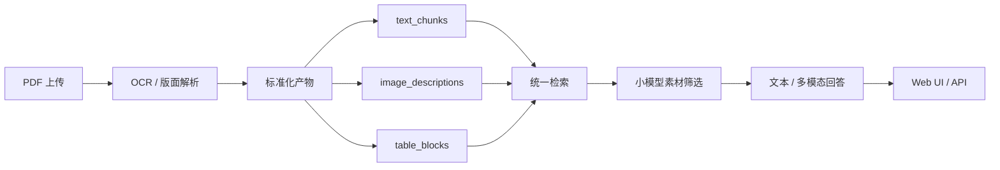

# 复杂文档 RAG 解析

一个面向复杂 PDF 文档的多模态 RAG 项目。

它支持在 Web 页面里直接上传 PDF，自动完成 OCR、结构化解析、向量入库，并在同一套界面里验证问答效果。系统会分别建立文本、图片、表格三路索引，在回答阶段做素材筛选；命中图片时会把原图传给多模态模型，流程图类问题还可以输出 Mermaid 图。

## 适合什么场景

- 安全规范、SOP、工艺文件、质控文档等复杂 PDF 的问答验证
- 带图片、流程图、表格的文档检索与解释
- 需要先做本地原型，再集成到现有业务系统中的 RAG 项目

## 核心能力

- 前端上传 PDF，选择 OCR 模型和并发数
- OCR 后生成标准化中间产物
- 文本、图片、表格三路分别写入 Qdrant
- 流式回答、证据面板、回答附图/附表展示
- 小模型二次筛选回答素材，减少不相关图表噪声
- 图片命中时走多模态回答，表格命中时走结构化表格上下文
- 流程图问题支持输出 Mermaid 代码块并在前端渲染

## 系统结构



## 仓库亮点

- 一个项目里同时包含摄入、索引、问答和前端验证页面
- 默认走 OpenAI-compatible 接口，方便接 DashScope / Qwen 或 OpenAI
- 保留了适合集成的 HTTP API 和 Python 内部入口
- 文档结构清晰，便于后续替换成 pgvector 等存储层

## 5 分钟跑起来

### 1. 准备环境

- Python 3.10+
- Docker
- 一个可用的 LLM / Embedding API Key

创建虚拟环境并安装依赖：

```bash
python -m venv .venv
source .venv/bin/activate
python -m pip install --upgrade pip
pip install -r requirements.txt
```

### 2. 配置环境变量

```bash
cp .env.example .env
```

至少需要填写：

- `OPENAI_API_KEY`
- 如果使用 DashScope / Qwen：
  - `OPENAI_BASE_URL=https://dashscope.aliyuncs.com/compatible-mode/v1`
  - `TEXT_LLM_MODEL`
  - `WEB_ANSWER_LLM_MODEL`
  - `MULTIMODAL_LLM_MODEL`
  - `EMBEDDING_MODEL`

### 3. 启动 Qdrant

```bash
docker run -p 6333:6333 qdrant/qdrant
```

### 4. 启动服务

```bash
python complex_document_rag/web_app.py
```

### 5. 打开页面

- 问答页：[http://127.0.0.1:8000/](http://127.0.0.1:8000/)
- 摄入页：[http://127.0.0.1:8000/ingest](http://127.0.0.1:8000/ingest)

## 使用方式

### 方式 A：从前端上传 PDF

1. 打开 `/ingest`
2. 选择 PDF
3. 选择 OCR 模型和并发数
4. 点击“开始摄入”
5. 完成后回到问答页提问

### 方式 B：命令行摄入

```bash
python complex_document_rag/step0_document_ingestion.py \
  --input "/absolute/path/to/file.pdf" \
  --ocr-model qwen3.5-plus \
  --workers 4
```

然后启动问答页面：

```bash
python complex_document_rag/web_app.py
```

## 运行后会得到什么

每次摄入会在 `complex_document_rag/ingestion_output/<doc_id>/` 下生成：

- `document.md`
- `manifest.json`
- `image_descriptions.json`
- `table_blocks.json`
- `images/`
- `raw_pdf_ocr/`

这些产物会继续被索引用于问答，也可以单独供其他系统消费。

## API 与集成

如果你想把它接到别的系统里，优先看这两份文档：

- 新电脑安装说明：[docs/setup-new-machine.md](docs/setup-new-machine.md)
- 集成技术文档：[docs/integration-guide.md](docs/integration-guide.md)

当前项目既可以：

- 作为独立 Sidecar 服务，通过 HTTP 调用
- 作为 Python 模块嵌入你的系统
- 只复用摄入产物，由你的系统接管检索和回答

## 主要目录

```text
complex-document-rag/
├── complex_document_rag/
│   ├── web_app.py
│   ├── web_helpers.py
│   ├── step0_document_ingestion.py
│   ├── step4_basic_query.py
│   ├── qdrant_management.py
│   └── web_static/
├── docs/
├── model_provider_utils.py
├── config.py
├── scripts/
└── tests/
```

## 测试

建议先跑这些高价值用例：

```bash
python -m unittest discover -s tests -p 'test_model_provider_utils.py'
python -m unittest discover -s tests -p 'test_web_app.py'
python -m unittest discover -s tests -p 'test_web_static_frontend.py'
python -m unittest discover -s tests -p 'test_web_static_ingest_frontend.py'
```

## 当前边界

- 当前只支持 PDF 上传
- 默认面向本地调试和原型验证
- 默认存储层是 Qdrant
- 暂不包含用户体系、权限控制、任务队列和生产级部署编排

## 后续扩展方向

- 替换向量层为 PostgreSQL + pgvector
- 增加多文档管理、删除和重建索引能力
- 将摄入和问答拆分成独立服务
- 增加更严格的生产部署和监控体系

## 补充说明

- 如果开启 `WEB_ANSWER_ENABLE_THINKING=true`，前端会显示模型思考过程
- 流程图问题会尝试输出 Mermaid 图，同时保留文字解释
- 图片类问题命中后，回答模型会看到原图；表格类问题默认不传图，只传结构化表格内容
