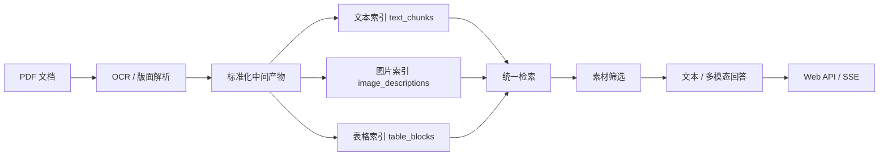
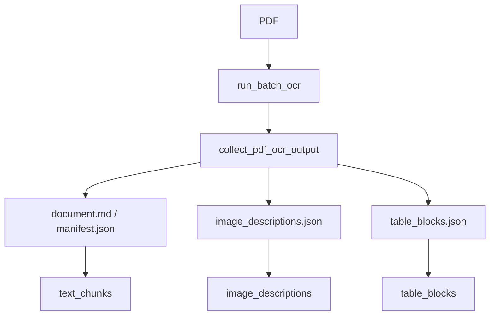
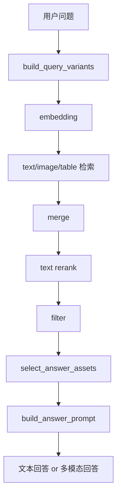

# 复杂文档 RAG 集成技术文档

## 1. 文档目的

本文档面向需要将当前项目集成到其他系统中的开发者，重点说明以下内容：

- 这套系统在运行时提供了哪些能力
- 离线摄入、在线检索、在线回答分别如何工作
- 作为独立服务接入时，应该调用哪些接口
- 作为 Python 模块嵌入时，应该调用哪些内部入口
- 需要准备哪些基础设施、环境变量和目录约定
- 哪些部分适合复用，哪些部分建议替换

本文档默认你集成的是当前仓库中已经标准化后的主链路：

- 运行入口：[complex_document_rag/cli.py](/Users/biyiyi/Downloads/ocr-markdown%202/complex-document-rag/complex_document_rag/cli.py)
- Web 装配入口：[complex_document_rag/web/routes.py](/Users/biyiyi/Downloads/ocr-markdown%202/complex-document-rag/complex_document_rag/web/routes.py)
- 问答核心：[complex_document_rag/web/backend.py](/Users/biyiyi/Downloads/ocr-markdown%202/complex-document-rag/complex_document_rag/web/backend.py)

而不是仓库早期 `step0/2/3/4` 式的兼容壳文件。

---

## 2. 系统边界

当前项目的核心能力可以概括为一条完整链路：



从集成角度看，这个项目对外暴露的是两类能力：

1. 文档摄入能力  
   输入 PDF，输出标准化中间产物，并将文本、图片、表格分别写入 Qdrant。

2. 问答能力  
   输入用户问题，返回：
   - 回答文本
   - 回答 HTML
   - 文本/图片/表格召回结果
   - 回答引用来源
   - 回答附图/附表

它不是一个“纯聊天模型包装层”，而是一个带有 PDF 摄入、证据组织、多分支召回和回答后处理的文档问答服务。

---

## 3. 推荐集成方式

推荐优先级如下。

### 3.1 方式 A：作为独立 Sidecar 服务接入

推荐程度：最高。

做法：

- 保持当前 FastAPI 服务独立运行
- 你的主项目通过 HTTP 调用它
- 摄入时调用 `/api/ingest/jobs`
- 查询时调用 `/api/query` 或 `/api/query/stream`

优点：

- 与主项目技术栈解耦
- 便于单独扩容和调试
- 不需要把 Qdrant、OCR、模型依赖全部塞进主服务
- 前端和后端都可以逐步替换

适用场景：

- 你已有主业务系统，只想接入“复杂 PDF RAG 能力”
- 你希望 OCR / Qdrant / 问答服务独立部署

### 3.2 方式 B：作为 Python 模块嵌入

推荐程度：中。

做法：

- 直接在你的 Python 项目中导入当前模块
- 复用 `create_app()`、`get_query_backend()`、`QueryBackend`

优点：

- 少一层网络跳转
- 适合内部后台工具或同仓服务

代价：

- 你的主服务要直接承担 OCR、Qdrant、模型调用依赖
- 部署和故障域耦合度更高

### 3.3 方式 C：只复用摄入结果，不直接复用服务

推荐程度：可选。

做法：

- 保留当前 `python -m complex_document_rag ingest ...` 作为离线构建器
- 你自己的系统只消费 `document.md`、`image_descriptions.json`、`table_blocks.json`
- 检索和回答逻辑由你的系统自己实现

适用场景：

- 你只认可当前摄入质量，不想直接复用现有 Web 服务

---

## 4. 核心目录与职责

### 4.1 Web 服务入口

- [complex_document_rag/web/routes.py](/Users/biyiyi/Downloads/ocr-markdown%202/complex-document-rag/complex_document_rag/web/routes.py)
- [complex_document_rag/web/backend.py](/Users/biyiyi/Downloads/ocr-markdown%202/complex-document-rag/complex_document_rag/web/backend.py)
- [complex_document_rag/web/jobs.py](/Users/biyiyi/Downloads/ocr-markdown%202/complex-document-rag/complex_document_rag/web/jobs.py)

职责：

- `web/routes.py` 负责创建 FastAPI 应用、挂载静态目录、注册 query/ingest routers、预热 backend
- `web/backend.py` 负责 `QueryBackend`、检索、素材筛选、回答生成、SSE 相关逻辑
- `web/jobs.py` 负责摄入任务状态、日志、后台执行和索引校验

### 4.2 配置入口

- [config.py](/Users/biyiyi/Downloads/ocr-markdown%202/complex-document-rag/config.py)

职责：

- 统一读取 `.env` 和环境变量
- 集中定义模型、Qdrant、Rerank 等配置

### 4.3 文档摄入编排

- [complex_document_rag/ingestion/pipeline.py](/Users/biyiyi/Downloads/ocr-markdown%202/complex-document-rag/complex_document_rag/ingestion/pipeline.py)
- [complex_document_rag/ingestion/artifacts.py](/Users/biyiyi/Downloads/ocr-markdown%202/complex-document-rag/complex_document_rag/ingestion/artifacts.py)
- [complex_document_rag/ingestion/images.py](/Users/biyiyi/Downloads/ocr-markdown%202/complex-document-rag/complex_document_rag/ingestion/images.py)
- [complex_document_rag/ingestion/tables.py](/Users/biyiyi/Downloads/ocr-markdown%202/complex-document-rag/complex_document_rag/ingestion/tables.py)

职责：

- `ingestion/pipeline.py` 调用外部 OCR 脚本并编排整条摄入链路
- `ingestion/artifacts.py` 负责 OCR 结果归一化、manifest 生成和产物收集
- `ingestion/images.py` 负责图片描述 payload 生成
- `ingestion/tables.py` 负责表格抽取和逻辑表合并

### 4.4 向量索引写入

- [complex_document_rag/indexing/text_index.py](/Users/biyiyi/Downloads/ocr-markdown%202/complex-document-rag/complex_document_rag/indexing/text_index.py)
- [complex_document_rag/indexing/image_index.py](/Users/biyiyi/Downloads/ocr-markdown%202/complex-document-rag/complex_document_rag/indexing/image_index.py)
- [complex_document_rag/indexing/table_index.py](/Users/biyiyi/Downloads/ocr-markdown%202/complex-document-rag/complex_document_rag/indexing/table_index.py)

职责：

- 将三类证据分别写入三个 Qdrant collection

### 4.5 模型提供方兼容层

- [model_provider_utils.py](/Users/biyiyi/Downloads/ocr-markdown%202/complex-document-rag/model_provider_utils.py)

职责：

- 文本 LLM 封装
- 多模态 LLM 封装
- OpenAI / DashScope 兼容接口统一
- Embedding 重试包装

### 4.6 Web 序列化与 HTML 渲染

- [complex_document_rag/web/helpers.py](/Users/biyiyi/Downloads/ocr-markdown%202/complex-document-rag/complex_document_rag/web/helpers.py)

职责：

- 将内部节点序列化成前端 payload
- 生成 `answer_html`
- 将表格中的相对图片路径重写为 `/artifacts/...`

---

## 5. 运行依赖

### 5.1 必需基础设施

- Python 运行环境
- Qdrant
- 可访问的模型服务
  - 文本回答模型
  - 多模态回答模型
  - Embedding 模型
- 外部 OCR 脚本依赖

当前服务不依赖数据库事务系统，也不依赖消息队列才能跑主链路。

### 5.2 可选基础设施

- SiliconFlow Rerank
  - 如果不开启，系统仍能运行，只是文本重排能力下降

### 5.3 文件系统依赖

当前实现依赖本地磁盘，主要目录如下：

- `complex_document_rag/ingestion_output/`
- `complex_document_rag/upload_jobs/`
- `complex_document_rag/web_static/`

如果你要把它集成进容器或别的服务，需要保证：

- 这些目录可写
- 回答阶段可访问摄入后的图片文件
- `/artifacts` 静态挂载能访问 `ingestion_output`

---

## 6. 关键环境变量

以下变量是接入时最关键的一组。

| 变量 | 是否必需 | 作用 |
|---|---|---|
| `OPENAI_API_KEY` / `DASHSCOPE_API_KEY` | 是 | 模型访问凭证 |
| `OPENAI_BASE_URL` | 是 | OpenAI 兼容接口根地址 |
| `MULTIMODAL_LLM_MODEL` | 是 | 图片描述和图片问答模型 |
| `TEXT_LLM_MODEL` | 是 | 轻量文本任务默认模型 |
| `WEB_ANSWER_LLM_MODEL` | 建议 | 前端问答模型 |
| `WEB_ANSWER_ENABLE_THINKING` | 可选 | 是否输出 reasoning |
| `EMBEDDING_MODEL` | 是 | 向量化模型 |
| `QDRANT_HOST` | 是 | Qdrant 地址 |
| `QDRANT_PORT` | 是 | Qdrant 端口 |
| `RERANK_ENABLED` | 可选 | 是否启用文本重排 |
| `RERANK_API_KEY` / `SILICONFLOW_API_KEY` | 可选 | Rerank 密钥 |
| `RERANK_MODEL` | 可选 | Rerank 模型 |
| `INGEST_DEFAULT_OCR_MODEL` | 可选 | 上传页默认 OCR 模型 |
| `INGEST_DEFAULT_WORKERS` | 可选 | 上传页默认并发数 |
| `ANSWER_IMAGE_INPUT_TOP_K` | 可选 | 回答阶段最多带入几张图片 |
| `ASSET_JUDGE_MODEL` | 可选 | 图表素材筛选小模型 |

说明：

- 多模态回答模型和文本回答模型可以相同，也可以不同。
- 当前项目已经支持在回答阶段直接把图片带入多模态模型。
- 如果 `answer_assets` 中只有表格，没有图片，当前实现不会把图像本体传给回答模型。

---

## 7. 数据产物约定

每个摄入文档会在 `complex_document_rag/ingestion_output/<doc_id>/` 下生成一套标准化产物。

典型结构：

```text
complex_document_rag/ingestion_output/<doc_id>/
├── document.md
├── manifest.json
├── image_descriptions.json
├── table_blocks.json
├── images/
└── raw_pdf_ocr/
```

### 7.1 `doc_id`

`doc_id` 是这套系统跨文件系统与 Qdrant 的主键。

它被用于：

- 产物目录名
- Qdrant payload 的 `doc_id`
- `/artifacts/<doc_id>/...` 访问路径
- 重复摄入时的旧向量删除

因此如果你从别的系统集成进来，建议保持 `doc_id` 稳定，不要每次随机生成。

### 7.2 `document.md`

作用：

- 全文 Markdown 版本
- 便于人工审查 OCR 结果
- 文本块的内容来源之一

### 7.3 `image_descriptions.json`

作用：

- 每张图的摘要、细节描述、节点、标签
- 图片索引的核心输入

### 7.4 `table_blocks.json`

作用：

- 每个表格块的标题、摘要、表头、正文
- 表格索引和表格回显的核心输入

### 7.5 `manifest.json`

作用：

- 汇总这次摄入生成了哪些文本块、图片块、表格块
- 便于后续审计、对接和清理

---

## 8. Qdrant 结构

当前固定使用三个 collection：

- `text_chunks`
- `image_descriptions`
- `table_blocks`

对应定义见 [config.py](/Users/biyiyi/Downloads/ocr-markdown%202/complex-document-rag/config.py#L96)。

### 8.1 删除策略

重复摄入同一个 `doc_id` 时，会先按 `doc_id` 删除旧向量，再重新写入。

相关实现见 [indexing/qdrant.py](/Users/biyiyi/Downloads/ocr-markdown%202/complex-document-rag/complex_document_rag/indexing/qdrant.py#L20)。

这意味着：

- 你的主项目如果希望“覆盖更新文档”，可以直接复用同一个 `doc_id`
- 不需要自己额外做版本回收逻辑

---

## 9. 离线摄入链路

### 9.1 主入口

离线摄入主入口：

- CLI：`python -m complex_document_rag ingest`
- 实现：[complex_document_rag/ingestion/pipeline.py](/Users/biyiyi/Downloads/ocr-markdown%202/complex-document-rag/complex_document_rag/ingestion/pipeline.py)

命令行示例：

```bash
python -m complex_document_rag ingest \
  --input "/absolute/path/to/your.pdf" \
  --ocr-model qwen3.5-plus \
  --workers 4 \
  --dpi 220
```

### 9.2 摄入流程



### 9.3 接入其他项目时的建议

如果你的主项目已经有自己的上传服务，推荐不要直接复用当前上传页，而是：

1. 由你的主项目保存上传文件
2. 调用当前服务的摄入 API 或 CLI
3. 约定返回 `doc_id`
4. 后续查询和资源访问都围绕 `doc_id` 展开

这样主项目仍然掌握上传鉴权和业务状态，而当前项目专注于“文档理解与索引”。

---

## 10. 在线问答链路

### 10.1 `QueryBackend` 角色

`QueryBackend` 是在线问答链路的核心对象，定义在 [web/backend.py](/Users/biyiyi/Downloads/ocr-markdown%202/complex-document-rag/complex_document_rag/web/backend.py)。

职责包括：

- 懒加载三套索引
- 生成 query variants
- 调用 embedding
- 分支检索文本 / 图片 / 表格
- 文本 rerank
- 过滤低相关证据
- 选择回答素材
- 构造回答 prompt
- 触发文本或多模态回答

### 10.2 在线检索数据流



### 10.3 Query Expansion

当前项目会自动把部分中英混合术语扩展成双语 query。

例如：

- `MRB触发时机`
- `MRB触发时机 Material Review Board trigger criteria when to initiate`

这对英文流程图、英文表格标题、中文问题之间的匹配有帮助。

### 10.4 素材筛选

在图表都被召回后，不会直接把所有素材都塞给回答模型，而是会先经过一层素材筛选。

筛选职责：

- 去掉只是“关键词沾边”的图表
- 保留更值得展示给用户的素材
- 为最终回答挑选 `answer_assets`

### 10.5 多模态回答

如果最终 `answer_assets` 中存在 `image_description`，系统会：

- 从对应节点中找到本地图片路径
- 将图片作为 `image_url` 输入带入多模态模型
- 同时保留文本证据和表格证据

如果最终 `answer_assets` 中只有表格，没有图片，则：

- 只传结构化表格文本
- 不传图像本体

这是当前项目非常关键的集成约定。

---

## 11. HTTP API 说明

### 11.1 健康检查

`GET /api/health`

响应：

```json
{"status":"ok"}
```

### 11.2 默认测试问题

`GET /api/default-queries`

响应：

```json
{
  "queries": [
    "使用有毒物品作业场所应设置哪些警示标识？"
  ]
}
```

### 11.3 查询接口（同步）

`POST /api/query`

请求体：

```json
{
  "query": "低良率不合格处理流程单（flow图）",
  "generate_answer": true
}
```

响应体关键字段：

```json
{
  "query": "...",
  "answer": "...",
  "answer_html": "...",
  "answer_error": "",
  "retrieval_error": "",
  "retrieval": {
    "text_results": [],
    "image_results": [],
    "table_results": []
  },
  "answer_sources": [],
  "answer_assets": []
}
```

适用场景：

- 服务端对服务端调用
- 不需要 token 级流式更新

### 11.4 查询接口（流式）

`POST /api/query/stream`

请求体与 `/api/query` 相同，但响应为 `text/event-stream`。

事件类型包括：

- `retrieval`
- `reasoning`
- `chunk`
- `error`
- `done`

其中：

- `retrieval` 会先返回召回结果和回答素材
- `reasoning` 是模型思考流
- `chunk` 是回答 token 流
- `done` 返回最终答案和 `answer_html`

这意味着如果你的主项目已有自己的前端，你不必复用当前静态页面，只要消费 SSE 即可。

### 11.5 摄入选项接口

`GET /api/ingest/options`

返回可选 OCR 模型和并发数约束。

### 11.6 创建摄入任务

`POST /api/ingest/jobs`

请求方式：

- `multipart/form-data`

字段：

- `file`
- `ocr_model`
- `workers`

响应状态：

- `202 Accepted`

返回任务元数据：

```json
{
  "job_id": "job_xxx",
  "status": "queued",
  "filename": "sample.pdf",
  "ocr_model": "qwen3.5-plus",
  "workers": 4
}
```

### 11.7 查询摄入任务状态

`GET /api/ingest/jobs/{job_id}`

响应中会包含：

- 状态
- 开始/结束时间
- 实时日志
- 错误信息
- `doc_id`
- `output_dir`

---

## 12. 响应数据结构说明

### 12.1 `retrieval.text_results[*]`

关键字段：

- `kind`
- `score`
- `doc_id`
- `page_no`
- `page_label`
- `source_path`
- `text`
- `snippet`
- `block_id`

### 12.2 `retrieval.image_results[*]`

关键字段：

- `kind=image`
- `score`
- `doc_id`
- `page_no`
- `page_label`
- `image_id`
- `image_path`
- `image_url`
- `summary`

### 12.3 `retrieval.table_results[*]`

关键字段：

- `kind=table`
- `score`
- `doc_id`
- `page_no`
- `page_label`
- `table_id`
- `caption`
- `semantic_summary`
- `headers`
- `raw_table`
- `raw_format`
- `normalized_table_text`

### 12.4 `answer_assets`

`answer_assets` 是最终回答时附带展示给用户的图表素材。

它与 `retrieval` 的区别是：

- `retrieval` 是召回候选
- `answer_assets` 是被认为值得随答案一起展示的最终素材

集成时建议优先展示 `answer_assets`，再在“查看更多证据”区域展示 `retrieval`。

---

## 13. 前端集成建议

如果你打算把这套能力接到别的 Web 前端，有三种推荐做法。

### 13.1 最小接入

只调用：

- `/api/query`

渲染：

- `answer_html`
- `answer_assets`

适用于：

- 后台工具
- 管理台页面
- 对实时流式体验要求不高的场景

### 13.2 标准接入

调用：

- `/api/query/stream`

处理事件：

- `retrieval`
- `reasoning`
- `chunk`
- `done`

适用于：

- 聊天式问答前端
- 需要展示思考过程、逐 token 输出的界面

### 13.3 完整接入

同时接入：

- `/api/ingest/jobs`
- `/api/query/stream`

适用于：

- 用户先上传 PDF，再即时提问的产品

---

## 14. 作为 Python 模块集成

如果你的项目本身就是 Python 服务，可以直接复用以下入口。

### 14.1 挂载 FastAPI 应用

```python
from complex_document_rag.web.routes import create_app

app = create_app()
```

适用场景：

- 你的主项目也是 FastAPI
- 想直接把当前服务挂到主应用中

### 14.2 直接调用 QueryBackend

```python
from complex_document_rag.web.backend import get_query_backend

backend = get_query_backend()
retrieval = backend.retrieve("关键不良处理流程（flow图）")
answer = backend.answer("关键不良处理流程（flow图）", retrieval=retrieval)
```

适用场景：

- 你有自己的 API 层
- 只想复用检索与回答能力

注意：

- `get_query_backend()` 带缓存
- 第一次调用会加载索引
- 重复摄入后如果想立刻可查，需要清缓存并重建 backend

---

## 15. 部署与运维建议

### 15.1 服务拆分建议

如果要接入线上系统，建议至少拆成两个进程：

1. 摄入服务  
   负责上传、OCR、索引写入。

2. 查询服务  
   负责检索、回答和前端交互。

这样做的原因：

- OCR 和索引写入是重任务
- 查询服务更重视响应时间
- 可以分别做资源和超时配置

### 15.2 日志关注点

当前服务日志会输出：

- `[warmup]`
- `[query]`
- `[embed]`
- `[qdrant]`
- `[rerank]`
- `[filter]`
- `[retrieve]`
- `[llm-any]`
- `[llm-ttft]`
- `[llm-done]`
- `[visual]`
- `[visual-ok]`

接入后建议将这些日志接到统一日志系统，便于区分：

- 检索慢
- 模型慢
- 是否真的走了看图回答

### 15.3 常见故障

1. 服务启动正常，但回答无图  
   原因通常是 `answer_assets` 中没有图片，或图片路径失效。

2. 摄入完成，但问不到新文档  
   原因通常是 backend 缓存未刷新。

3. 前端显示有图片卡片，但图片打不开  
   原因通常是 `/artifacts` 路径或 `image_path` 不一致。

4. 多模态回答没有触发  
   原因通常是问题没命中图片素材，或素材筛选把图片过滤掉了。

---

## 16. 可替换点与扩展点

以下模块最适合在别的项目中替换。

### 16.1 替换 OCR

你可以保留后续归一化和索引逻辑，只替换 `run_batch_ocr()` 上游。

### 16.2 替换向量库

如果你不用 Qdrant，可以保留中间产物结构，重写：

- 文本索引写入
- 图片索引写入
- 表格索引写入
- 三分支检索

### 16.3 替换回答模型

你可以保留当前检索与素材筛选，只替换：

- `create_text_llm`
- `create_multimodal_llm`

### 16.4 替换前端

如果你已有聊天前端，最值得复用的是：

- `/api/query/stream`
- `answer_assets`
- `answer_sources`
- `retrieval`

当前静态页面不是必须复用的。

---

## 17. 集成 checklist

在别的项目接入前，建议逐项确认。

### 基础设施

- Qdrant 可连通
- 模型服务可连通
- OCR 依赖可运行
- `ingestion_output` 可写

### 配置

- `.env` 已配置
- `MULTIMODAL_LLM_MODEL` 已确认
- `WEB_ANSWER_LLM_MODEL` 已确认
- `EMBEDDING_MODEL` 已确认

### 数据

- 至少成功摄入 1 个 PDF
- `document.md`、`image_descriptions.json`、`table_blocks.json` 已生成
- 三个 collection 已写入数据

### API

- `/api/health` 正常
- `/api/query` 正常
- `/api/query/stream` 正常
- `/api/ingest/jobs` 正常

### 体验

- 文本问题可回答
- 表格问题可展示表格
- 图片问题可走多模态回答
- 流程图问题可输出 Mermaid

---

## 18. 推荐的最小集成方案

如果你只想最快把它并到别的项目里，建议按下面做。

1. 保持当前项目独立部署  
2. 只暴露：
   - `/api/query/stream`
   - `/api/ingest/jobs`
   - `/api/ingest/jobs/{job_id}`
3. 主项目负责：
   - 用户鉴权
   - 文件上传入口
   - 会话管理
   - 业务对象与 `doc_id` 绑定
4. 当前项目负责：
   - OCR
   - 中间产物生成
   - Qdrant 写入
   - 检索
   - 回答
   - Mermaid 流程图输出

这是当前代码改动最少、风险最低、后续演进空间最大的接入方式。

---

## 19. 如果后续改成 PostgreSQL + pgvector

如果你后续的正式环境向量库不是 Qdrant，而是 PostgreSQL + pgvector，这套系统仍然可以接，但要明确一点：

- 当前代码的“文档结构、摄入产物、回答链路”可以继续复用
- 当前代码的“向量存储实现”是明显偏 Qdrant 的，需要替换

也就是说，真正需要动的是“向量层”，不是整套 RAG 逻辑。

### 19.1 哪些部分可以保持不变

以下部分与向量库无关，或者关系很弱，可以直接保留：

- PDF 摄入入口  
  [ingestion/pipeline.py](/Users/biyiyi/Downloads/ocr-markdown%202/complex-document-rag/complex_document_rag/ingestion/pipeline.py)
- OCR 结果归一化  
  [ingestion/artifacts.py](/Users/biyiyi/Downloads/ocr-markdown%202/complex-document-rag/complex_document_rag/ingestion/artifacts.py) / [ingestion/images.py](/Users/biyiyi/Downloads/ocr-markdown%202/complex-document-rag/complex_document_rag/ingestion/images.py) / [ingestion/tables.py](/Users/biyiyi/Downloads/ocr-markdown%202/complex-document-rag/complex_document_rag/ingestion/tables.py)
- 中间产物结构
  - `document.md`
  - `manifest.json`
  - `image_descriptions.json`
  - `table_blocks.json`
- 回答层
  - 素材筛选
  - 文本 / 多模态回答
  - Mermaid 输出
- Web API 协议
  - `/api/query`
  - `/api/query/stream`
  - `/api/ingest/jobs`

### 19.2 哪些部分必须替换

需要替换或重写的文件主要是这几类。

#### 1. 文本索引写入

- [indexing/text_index.py](/Users/biyiyi/Downloads/ocr-markdown%202/complex-document-rag/complex_document_rag/indexing/text_index.py)

当前实现使用：

- `QdrantClient`
- `QdrantVectorStore`
- `VectorStoreIndex.from_documents(...)`

如果切到 pgvector，需要改成：

- PostgreSQL 连接
- pgvector 表结构
- 文本块 embedding 写入逻辑

#### 2. 图片索引写入

- [indexing/image_index.py](/Users/biyiyi/Downloads/ocr-markdown%202/complex-document-rag/complex_document_rag/indexing/image_index.py)

当前写的是 `image_descriptions` collection。  
切到 pgvector 后，需要把 `TextNode(text=detailed_description, metadata=...)` 这套数据写进 PostgreSQL 表。

#### 3. 表格索引写入

- [indexing/table_index.py](/Users/biyiyi/Downloads/ocr-markdown%202/complex-document-rag/complex_document_rag/indexing/table_index.py)

当前写的是 `table_blocks` collection。  
切到 pgvector 后，表格块同样改为 PostgreSQL 表。

#### 4. 索引加载与检索

- [retrieval/query_console.py](/Users/biyiyi/Downloads/ocr-markdown%202/complex-document-rag/complex_document_rag/retrieval/query_console.py)

这里的 `load_indexes()`、`as_retriever()`、`QdrantVectorStore(...)` 都是 Qdrant 耦合点。  
如果切 pgvector，这部分要改成：

- 加载 PostgreSQL / pgvector 检索器
- 文本、图片、表格三分支分别检索
- 返回和现在一致的节点结构

#### 5. 按 `doc_id` 删除旧向量

- [indexing/qdrant.py](/Users/biyiyi/Downloads/ocr-markdown%202/complex-document-rag/complex_document_rag/indexing/qdrant.py)

当前上传同名 PDF 时，会先按 `doc_id` 删除三套 collection 里的旧数据。  
切到 pgvector 后，需要改成 PostgreSQL 的删除逻辑：

```sql
delete from text_chunks where doc_id = $1;
delete from image_descriptions where doc_id = $1;
delete from table_blocks where doc_id = $1;
```

### 19.3 最推荐的改造方式

不要直接把所有 Qdrant 调用散改成 SQL。  
更稳的做法是先抽一层“向量仓储接口”。

建议抽成三个能力：

1. `upsert_text_nodes(nodes)`
2. `upsert_image_nodes(nodes)`
3. `upsert_table_nodes(nodes)`

以及三个检索能力：

1. `search_text(query_embedding, top_k)`
2. `search_images(query_embedding, top_k)`
3. `search_tables(query_embedding, top_k)`

再加一个：

1. `delete_doc(doc_id)`

这样上层的 `QueryBackend`、摄入编排、回答逻辑都不需要知道底层到底是 Qdrant 还是 pgvector。

### 19.4 pgvector 下推荐的表设计

建议保留当前三分支设计，不要强行合成一张大表。

```text
text_chunks
image_descriptions
table_blocks
```

原因：

- 现在系统本来就是三路检索
- 三类 payload 字段差异很大
- 后续更容易做阈值控制和模态差异化排序

推荐字段示意：

#### `text_chunks`

- `id`
- `doc_id`
- `block_id`
- `page_no`
- `page_label`
- `source_path`
- `text`
- `embedding vector(...)`

#### `image_descriptions`

- `id`
- `doc_id`
- `image_id`
- `page_no`
- `page_label`
- `image_path`
- `summary`
- `detailed_description`
- `tags jsonb`
- `metadata jsonb`
- `embedding vector(...)`

#### `table_blocks`

- `id`
- `doc_id`
- `table_id`
- `page_no`
- `page_label`
- `caption`
- `semantic_summary`
- `headers jsonb`
- `raw_table`
- `normalized_table_text`
- `metadata jsonb`
- `embedding vector(...)`

### 19.5 为什么我建议仍然保留三张表

你现在这套回答逻辑已经依赖三分支：

- 文本结果走文本 rerank
- 图片结果可能触发多模态回答
- 表格结果优先用结构化文本回答

如果把三类数据混成一张 pgvector 表，虽然也能做，但后面会出现：

- SQL 过滤条件变复杂
- payload 结构很臃肿
- 检索后分支处理更混乱

所以迁到 pgvector 时，建议迁的是“底层向量库”，不是“上层数据模型”。

### 19.6 迁移后的代码目标

理想状态下，你最终应该把当前实现变成这样：

```text
ingestion/pipeline.py
  -> vector_repository.upsert_*(...)

QueryBackend
  -> vector_repository.search_text(...)
  -> vector_repository.search_images(...)
  -> vector_repository.search_tables(...)
```

而不是：

```text
QueryBackend
  -> 直接写 Qdrant API / 直接写 SQL / 直接拼 provider-specific 逻辑
```

前者以后要从 pgvector 再换 Milvus、Weaviate、Elasticsearch 才容易。

### 19.7 对你当前项目的实际建议

既然你已经明确后续会用 PostgreSQL + pgvector，我建议分两步做：

1. 当前先继续用现有 Qdrant 版本把产品逻辑跑通  
   先验证：
   - 摄入质量
   - 素材筛选
   - 看图回答
   - Mermaid 流程图输出

2. 第二阶段再抽向量仓储层，把 Qdrant 替换成 pgvector  
   这样你迁移时只动：
   - 写入
   - 检索
   - 删除

而不会把 OCR、回答、前端一起拖进去重构。
